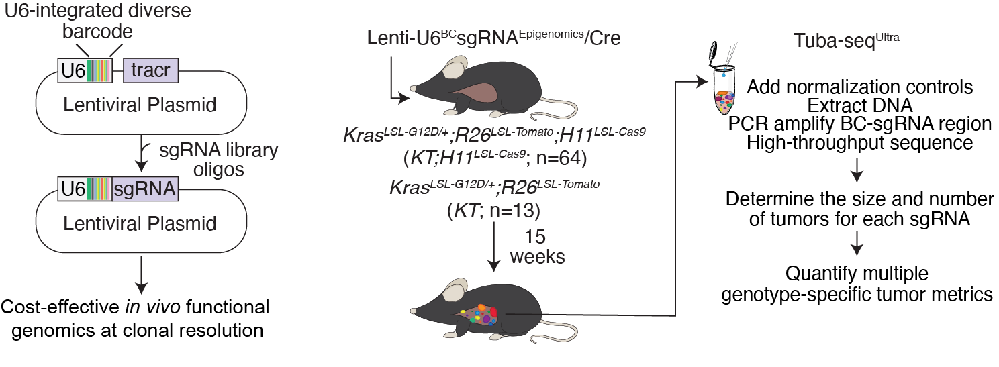

# ultra_seq_epigenomics

This repository provides code associated with: **Tang et al., Cancer Discovery 2025**  
[DOI: 10.1158/2159-8290.CD-24-1565](https://doi.org/10.1158/2159-8290.CD-24-1565)

---
## Overview

In this study, we developed a novel high-throughput functional genomics method, **Tuba-seqUltra**, which leverages clonal barcodes with CRISPR-Cas9 mediated somatic genome editing for high-resolution quantification of tumor initiation and growth.

*Tuba-seqUltra workflow schematic*

---
## Manuscript

## Functional Mapping of Epigenomic Regulators Uncovers Coordinated Tumor Suppression by the HBO1 and MLL1 Complexes

---

## Abstract

Epigenomic dysregulation is widespread in cancer, but the precise regulators and the processes by which they drive malignancy remain largely unknown. We developed a novel high-throughput in vivo screening approach to systematically interrogate over 250 epigenomic regulators in autochthonous oncogenic KRAS-driven lung tumors. This work revealed numerous previously unrecognized epigenomic tumor suppressor and dependency genes. We discovered that distinct HBO1 and MLL1 complexes act as robust tumor suppressors in lung adenocarcinoma. Histone modifications mediated by the HBO1 complex are frequently decreased in human lung adenocarcinomas and correlate with worse clinical outcomes. HBO1 and MLL1 complexes co-occupy shared genomic regions, modulate chromatin accessibility, and regulate the expression of canonical tumor suppressor genes as well as lineage fidelity. Furthermore, the HBO1 complex is epistatic with the MLL1 complex and other tumor suppressor genes in the progression of lung adenocarcinoma. Together, our results offer a phenotypic roadmap for the roles of epigenomic regulators during lung tumorigenesis in vivo.
